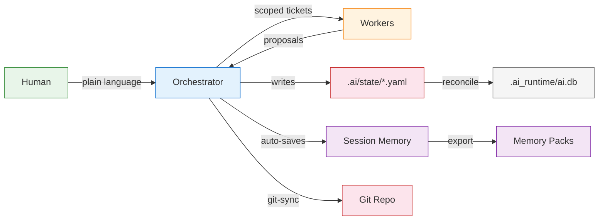

# Scaffold AI

```
            ─────────────╦══════════════╗
                         ║              ╠═╗
                         ║              ║ │
                         ║              ║ ◆
                         ║
                         ║   S C A F F O L D  A I
                         ║
                         ║   AI agent orchestration
                         ║   for real projects.
                         ║
                         ║   One leader. Many workers.
                         ║   State you can read.
                         ║   Memory that travels.
                         ║
                       ══╩══
                      ▓▓▓▓▓▓▓
```

[](LICENSE)
[](https://www.python.org)
[](#persistence-model)
[](#persistence-model)

**A framework for running AI agent teams on real projects.**

One orchestrator leads. Workers execute. State is tracked in plain YAML, committed to your repo, and auditable by humans. Session memory persists automatically. Move between machines without losing context.

### What you get

- **One leader, many workers** — single orchestrator with write authority; workers are read-only
- **Project state in plain files** — YAML and Markdown, committed to git, diffable
- **Automatic persistence** — every turn saved, memory exported on exit, imported on startup
- **Portable context** — memory packs let you resume on any machine
- **Safety gates** — approval triggers pause execution until a human decides
- **Works with any AI model** — no vendor lock-in, no API keys in the framework itself
- **Submodule-ready** — engine updates via pointer bump, never touches your project state

### Who this is for

| Good fit | Not a fit |
|----------|-----------|
| Teams using AI agents to manage software projects | End users looking for a chat app |
| Developers who want auditable, git-tracked AI state | Projects that need a hosted SaaS platform |
| Multi-machine workflows needing portable context | Single-prompt, one-shot AI usage |

---

## How It Works



**Two storage layers, clear separation:**

| Layer | Location | Committed? | Purpose |
|-------|----------|------------|---------|
| Canonical state | `.ai/` | Yes | Project truth — tasks, team, decisions, status |
| Runtime cache | `.ai_runtime/` | Never | SQLite DB, session memory, logs, memory packs |

> If the database and YAML disagree, the YAML is correct. The database is a derived view, rebuilt on demand.

---

## Quick Start (Talk to AI)

You don't need to run commands. Just tell your AI what to do.

### Step 1 — Set up the project

If this is a new project or the system isn't set up yet, tell your AI:

```
Pull the Scaffold AI skeleton into this project as a submodule at vendor/scaffold-ai, then run its initializer to set up the .ai/ directory and runtime.
```

The AI will handle cloning, submodule setup, and initialization. No terminal required.

If the skeleton is already present, skip to the next step.

### Step 2 — Activate the protocol

Paste this at the start of any new AI session:

```
Load `.ai/AGENTS.md` as your operating protocol, align to the current project state (resume if it exists, initialize if not), enforce command-first behavior with no freestyle outputs, and confirm readiness by summarizing project status and listing available commands.
```

This is the single activation prompt. It works with Claude Code, OpenAI Codex CLI, and Cursor (partial support). These tools may auto-load protocol files, but this prompt guarantees correct behavior.

### Step 3 — Talk to it

Once active, just say what you need:

- **"Show me the current status"** — see project state and progress
- **"What's been completed and what's next?"** — task overview
- **"Start or initialize the project"** — set up from scratch
- **"Save current progress"** — export memory for continuity
- **"Validate the project"** — check state integrity
- **"Help"** — see the full prompt guide

The system maps your intent to the right action automatically. No commands to memorize.

---

### Developer Setup (CLI)

If you prefer terminal commands or need to set up CI/automation:

```bash
# Add skeleton as a submodule
git submodule add https://github.com/sebby26-cyber/scaffold-ai.git vendor/scaffold-ai

# Initialize (does not overwrite existing project files)
python3 vendor/scaffold-ai/engine/ai init

# Check project status
python3 vendor/scaffold-ai/engine/ai status

# Validate state files against schemas
python3 vendor/scaffold-ai/engine/ai validate

# Context-aware help guide
python3 vendor/scaffold-ai/engine/ai help
```

The orchestrator loads `.ai/AGENTS.md` automatically at startup. Root bridge files (`AGENTS.md`, `CLAUDE.md`) are auto-read by Codex and Claude Code respectively, so AI tools inherit project identity on session start with zero setup.

Optional: create a wrapper script at your project root:

```bash
#!/usr/bin/env bash
exec python3 "$(dirname "$0")/vendor/scaffold-ai/engine/ai" "$@"
```

**Prerequisites:** Python 3.9+, PyYAML (`pip install pyyaml`), Git

---

## Core Concepts

### Single-Writer Authority

The orchestrator is the only agent that writes canonical state and commits to the repository. Workers receive scoped tickets, produce output, and never modify shared state directly. This eliminates merge conflicts, ambiguous audit trails, and partial-state bugs.

### Persistence Model

**Canonical state** (`.ai/state/*.yaml`, `STATUS.md`, `DECISIONS.md`) is committed after every meaningful change. Clone the repo and the full project state is present.

**Runtime cache** (`.ai_runtime/`) holds the SQLite database, session memory, and logs. It is never committed and is fully rebuildable from canonical YAML via `ai rehydrate-db`.

**Session memory** persists every orchestrator turn to a local SQLite database. A memory pack is auto-exported on exit and auto-imported from `.ai_runtime/import_inbox/` on startup. No manual save commands needed.

### Memory Packs

Portable snapshots of session history. Canonical YAML records what is true now; memory packs record what happened. Export as zip, drop into `import_inbox/` on a new machine, and the orchestrator resumes with full context.

### Git Sync Safety

`ai git-sync` stages only whitelisted paths (`.ai/state/`, `STATUS.md`, `DECISIONS.md`, `METADATA.yaml`). Any non-whitelisted file that ends up staged is automatically unstaged before commit. `.ai_runtime/` is never committed.

---

## Talking to the Orchestrator

You interact using natural language. No commands to memorize. The orchestrator translates your intent into internal actions automatically.

| You say | What happens |
|---------|-------------|
| "Show me the current status" | Generates project status report |
| "What's been completed and what's next?" | Shows task progress and priorities |
| "Are there any blockers?" | Surfaces blocked tasks and issues |
| "Save current progress" | Exports memory pack for continuity |
| "Restore previous session" | Imports a memory pack |
| "Sync project state" | Commits canonical state to git |
| "Validate the project" | Checks YAML integrity against schemas |
| "Help" | Shows the full human prompt guide |

---

## Command Reference

> These run under the hood. This table is for power users, CI, and debugging.

| Command | Purpose | Modifies |
|---------|---------|----------|
| `ai help` | Context-aware help guide (supports `--json`) | Nothing (read-only) |
| `ai init` | Initialize `.ai/` and `.ai_runtime/` | Creates dirs, stamps metadata |
| `ai run` | Start interactive orchestrator loop | Session memory only |
| `ai status` | Print project status report | Renders STATUS.md |
| `ai validate` | Validate YAML against schemas | Nothing (read-only) |
| `ai git-sync` | Commit canonical state to git | Whitelisted `.ai/` files only |
| `ai rehydrate-db` | Rebuild SQLite from YAML | `.ai_runtime/ai.db` only |
| `ai migrate` | Apply new template files | Adds missing files, never overwrites |
| `ai export-memory` | Export canonical memory pack | `.ai_runtime/` only |
| `ai import-memory --in PATH` | Import canonical memory pack | `.ai_runtime/` only |
| `ai memory export` | Export session memory pack | `.ai_runtime/` only |
| `ai memory import --in PATH` | Import session memory pack | `.ai_runtime/` only |
| `ai memory purge` | Purge session memory | `.ai_runtime/session/` only |

---

## Resuming on a New Machine

```bash
git clone <your-project-repo>
git submodule update --init --recursive
python3 vendor/scaffold-ai/engine/ai init --non-interactive
```

This rebuilds the local runtime from committed state. The orchestrator knows the current phase, task board, and decisions immediately.

**For richer continuity**, drop a memory pack into `.ai_runtime/import_inbox/` before running `ai run`. It auto-imports on startup and moves the pack to `processed/`.

---

## How It's Meant to Be Used

This is **infrastructure you add to a project** to help AI agents run it reliably. It is not an application you deploy to end users.

- Humans interact by asking for status, giving approvals, and setting direction
- The orchestrator manages tasks, delegates to workers, and commits state changes
- Workers produce output within scoped boundaries; they never commit directly
- Everything is tracked in version-controlled YAML that humans can read and audit

The skeleton is **submodule-ready**: add it to any git project, initialize, and the orchestrator takes over project management. Engine updates propagate via `git submodule update` and `ai migrate` without touching your project state.

---

## Help / Guide

Say **"help"**, **"guide me"**, or **"what can you do?"** to get a context-aware guide tailored to your project's current state. The guide shows human-friendly prompts organized by category (Getting Started, Project Visibility, Memory & Continuity, System Actions) with CLI commands listed as an advanced reference at the bottom.

For the CLI: `ai help` (terminal) or `ai help --json` (for Kanban UI integration).

---

## Docs Map

| Document | What it covers |
|----------|---------------|
| [Authority Model](templates/.ai/core/AUTHORITY_MODEL.md) | Single-writer architecture, role permissions |
| [Worker Execution Rules](templates/.ai/core/WORKER_EXECUTION_RULES.md) | Worker boundaries, ticket format, read-only policy |
| [Orchestrator System Prompt](templates/.ai/prompts/orchestrator_system.md) | Orchestrator behavior and responsibilities |
| [Status Report Protocol](templates/.ai/core/STATUS_REPORT_PROTOCOL.md) | How status reports are generated |
| [Project Execution Lifecycle](PROJECT_EXECUTION_LIFECYCLE.md) | End-to-end workflow phases |
| [Execution Guardrails](EXECUTION_GUARDRAILS.md) | Safety constraints and approval gates |
| [Lead Agent Operating Model](LEAD_AGENT_OPERATING_MODEL.md) | Orchestrator operational patterns |
| [Context Persistence System](CONTEXT_PERSISTENCE_SYSTEM.md) | Persistence architecture details |
| [Agent Handoff/Resume Protocol](AGENT_HANDOFF_RESUME_PROTOCOL.md) | Cross-machine continuity procedures |
| [Smoke Test: Auto-Persistence](docs/SMOKE_TEST_AUTOPERSIST.md) | Manual verification steps |
| [Engine README](engine/README.md) | Engine internals, module map |
| [Operator Protocol](templates/.ai/AGENTS.md) | Agent behavior rules, command routing, startup checklist |

### AGENTS.md / Operator Protocol

**Protocol location:** `.ai/AGENTS.md` (canonical), root bridges: `AGENTS.md`, `CLAUDE.md`.

`.ai/AGENTS.md` is the single source of truth for how AI agents behave in this project. It is copied from templates during `ai init` and loaded automatically at the start of every session. Root-level bridge files (`AGENTS.md` for Codex, `CLAUDE.md` for Claude Code) are also created by `ai init` — these instruct the tool to read and follow the canonical protocol, giving agents project identity on first interaction.

It defines: a startup checklist, deterministic command mode (prefix `/` always routes to handlers), the no-freestyle rule (status/help/report must use the repo's generators, never improvise), drift control (repo state always overrides chat history), and natural language shortcuts. To force command mode from any agent, prefix your message with `/` (e.g. `/status`, `/help --json`).

**Supported tools:** Claude Code (auto-loads `CLAUDE.md`), OpenAI Codex (auto-loads `AGENTS.md`), Cursor (partial/evolving support). On session start, the agent confirms protocol load before proceeding.

---

## License

MIT — see [LICENSE](LICENSE) for details.

---

*v1 engine. Commands and schemas are stable. Engine updates via submodule will not break existing canonical state.*
