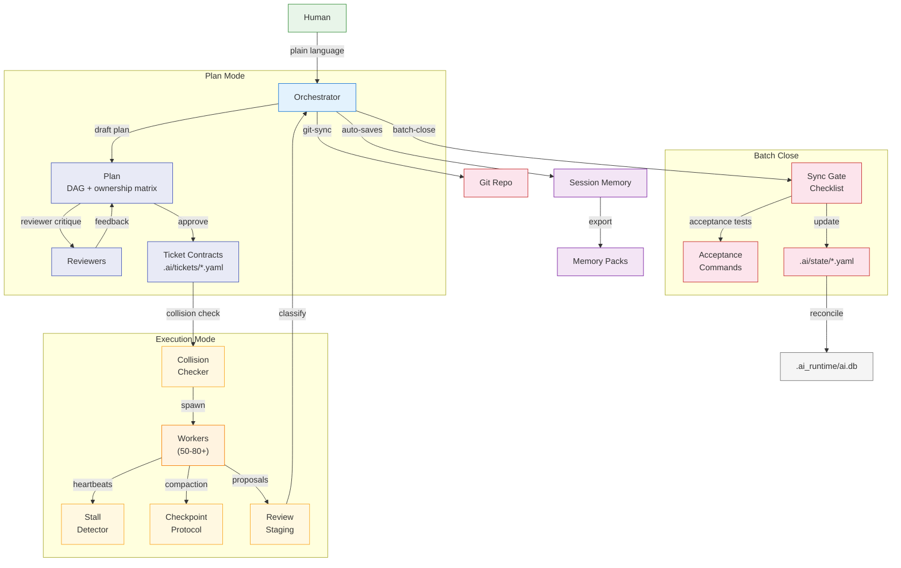

# Scaffold AI

```
            ─────────────╦══════════════╗
                         ║              ╠═╗
                         ║              ║ │
                         ║              ║ ◆
                         ║
                         ║   S C A F F O L D  A I
                         ║
                         ║   AI agent orchestration
                         ║   for real projects.
                         ║
                         ║   One leader. Many workers.
                         ║   State you can read.
                         ║   Memory that travels.
                         ║
                       ══╩══
                      ▓▓▓▓▓▓▓
```

[](LICENSE)
[](https://www.python.org)
[](#persistence-model)
[](#persistence-model)

**A framework for running AI agent teams on real projects.**

One orchestrator leads. Workers execute. State is tracked in plain YAML, committed to your repo, and auditable by humans. Session memory persists automatically. Move between machines without losing context.

### What you get

- **One leader, many workers** — single orchestrator with write authority; worker bees run in parallel across departments
- **Plan before you execute** — explicit plan mode produces DAGs, ownership matrices, and batch plans before any code changes
- **Ticket contracts** — every worker gets a machine-enforceable ticket with allowed files, forbidden files, diff budgets, and acceptance commands
- **Collision prevention** — file ownership matrix detects overlapping tickets before workers spawn
- **Stall detection** — behavior-based detection catches token-burn, read loops, and silent workers
- **Approval tiers** — auto, PM, orchestrator, and user approval levels per ticket
- **Granularity levels** — L0 (strategic) through L4 (integration) for plans and tickets
- **Context compaction** — provider-agnostic checkpoint protocol prevents long-context failures
- **Core truths** — machine-checkable invariants that tickets must reference and respect
- **Project state in plain files** — YAML and Markdown, committed to git, diffable
- **Automatic persistence** — every turn saved, memory exported on exit, imported on startup
- **Portable context** — memory packs let you resume on any machine
- **Safety gates** — approval triggers pause execution until a human decides
- **Multi-provider workers** — Claude, Codex, Gemini, and any future CLI tool; provider + model per role
- **Auto-recovery** — workers that stall or hit token limits are checkpointed and resumed automatically
- **Stays focused** — scope guardrails prevent drift outside project boundaries
- **Works with any AI model** — no vendor lock-in, no API keys in the framework itself
- **Submodule-ready** — engine updates via pointer bump, never touches your project state

### Who this is for

| Good fit | Not a fit |
|----------|-----------|
| Teams using AI agents to manage software projects | End users looking for a chat app |
| Developers who want auditable, git-tracked AI state | Projects that need a hosted SaaS platform |
| Multi-machine workflows needing portable context | Single-prompt, one-shot AI usage |

---

## How It Works


```mermaid
graph TD
    H["Human"] -->|plain language| O["Orchestrator"]

    subgraph "Plan Mode"
        O -->|draft plan| PM["Plan<br/>DAG + ownership matrix"]
        PM -->|reviewer critique| RV["Reviewers"]
        RV -->|feedback| PM
        PM -->|approve| TK["Ticket Contracts<br/>.ai/tickets/*.yaml"]
    end

    subgraph "Execution Mode"
        TK -->|collision check| CC["Collision<br/>Checker"]
        CC -->|spawn| W["Workers<br/>(50-80+)"]
        W -->|heartbeats| SD["Stall<br/>Detector"]
        W -->|compaction| CP["Checkpoint<br/>Protocol"]
        W -->|proposals| RS["Review<br/>Staging"]
        RS -->|classify| O
    end

    subgraph "Batch Close"
        O -->|batch-close| BC["Sync Gate<br/>Checklist"]
        BC -->|acceptance tests| AT["Acceptance<br/>Commands"]
        BC -->|update| Y[".ai/state/*.yaml"]
    end

    Y -->|reconcile| DB[".ai_runtime/ai.db"]
    O -->|auto-saves| SM["Session Memory"]
    SM -->|export| MP["Memory Packs"]
    O -->|git-sync| G["Git Repo"]

    style H fill:#e8f5e9,stroke:#388e3c
    style O fill:#e3f2fd,stroke:#1976d2
    style W fill:#fff3e0,stroke:#f57c00
    style TK fill:#e8eaf6,stroke:#3f51b5
    style PM fill:#e8eaf6,stroke:#3f51b5
    style RV fill:#e8eaf6,stroke:#3f51b5
    style CC fill:#fff8e1,stroke:#f9a825
    style SD fill:#fff8e1,stroke:#f9a825
    style CP fill:#fff8e1,stroke:#f9a825
    style RS fill:#fff8e1,stroke:#f9a825
    style BC fill:#fce4ec,stroke:#c62828
    style AT fill:#fce4ec,stroke:#c62828
    style Y fill:#fce4ec,stroke:#c62828
    style DB fill:#f5f5f5,stroke:#757575
    style SM fill:#f3e5f5,stroke:#7b1fa2
    style MP fill:#f3e5f5,stroke:#7b1fa2
    style G fill:#fce4ec,stroke:#c62828
```

**Three storage layers, clear separation:**

| Layer | Location | Committed? | Purpose |
|-------|----------|------------|---------|
| Canonical state | `.ai/` | Yes | Project truth — tasks, team, decisions, tickets, core truths |
| Ticket contracts | `.ai/tickets/` | Yes | Per-worker scoped contracts with allowed files, approval tiers |
| Runtime cache | `.ai_runtime/` | Never | SQLite DB, session memory, logs, review staging, memory packs |
| Temp / cache | `.tmp/`, `.tmp_cache/` | Never | Scratch space, safe to delete anytime |

> If the database and YAML disagree, the YAML is correct. The database is a derived view, rebuilt on demand.

**Switching computers?** You're safe — your checkpoints and project state travel with the repo. Import a memory pack only if you want full chat history. See [Repo Hygiene](.ai/REPO_HYGIENE.md) for details.

---

## Quick Start (Talk to AI)

You don't need to run commands. Just tell your AI what to do.

### Step 1 — Set up the project

If this is a new project or the system isn't set up yet, tell your AI:

```
Pull the Scaffold AI skeleton from https://github.com/sebby26-cyber/scaffold-ai.git into this project as a submodule at scaffold/scaffold-ai, then run its initializer to set up the .ai/ directory and runtime.
`vendor/` is intentionally avoided because languages like Go use it for vendored dependencies (`go mod vendor`, auto-vendor mode, `vendor/modules.txt`).
```

The AI will handle cloning, submodule setup, and initialization. No terminal required.

If the skeleton is already present, skip to the next step.

### Step 2 — Activate the protocol

Paste this at the start of any new AI session:

```
Load `.ai/AGENTS.md` as your operating protocol, align to the current project state (resume if it exists, initialize if not), enforce command-first behavior with no freestyle outputs, and confirm readiness by summarizing project status and listing available commands.
```

This is the single activation prompt. It works with Claude Code, OpenAI Codex CLI, and Cursor (partial support). These tools may auto-load protocol files, but this prompt guarantees correct behavior.

On activation, the system runs a **compatibility gate** that verifies:
- All advertised capabilities have matching engine handlers (PASS/FAIL)
- Skeleton version matches the parent project's lock (detects updates)
- If any capability is missing, the system reports it and blocks readiness

After activation, the system will show the help guide automatically (or tell you to say "help"). Help only shows features that are actually implemented — never advertises unsupported commands.

### Step 3 — Talk to it

Once active, just say what you need. You don't need exact wording — the system understands common phrasing.

- **"Show me the current status"** — see project state and progress
- **"What's been completed and what's next?"** — task overview
- **"Start or initialize the project"** — set up from scratch
- **"Save everything now"** — force flush state + checkpoint workers
- **"Set up a team: 3 Codex devs + 1 Gemini analyst + 1 Claude designer"** — configure workers with provider/model
- **"Spawn worker bees"** — activate workers in parallel
- **"Resume stalled workers"** — recover workers that hit token limits
- **"Show me what each worker is doing"** — check worker status
- **"What's in scope?"** — see project boundaries
- **"Help"** — see the full prompt guide

The system maps your intent to the right action automatically. No commands to memorize.

---

## Requirements (AI CLI Setup)

This system uses AI tools installed on your computer. You need to install and log into one of these tools before using this project.

**Supported tools:**

| Tool | Status | Official setup |
|------|--------|----------------|
| Claude Code | Fully supported | [Installation guide](https://docs.anthropic.com/en/docs/claude-code/overview) |
| OpenAI Codex CLI | Fully supported | [Installation guide](https://github.com/openai/codex) |
| Gemini CLI | Supported (pass-through) | [Gemini CLI](https://ai.google.dev/gemini-api/docs) |
| Cursor | Partial support | [Getting started](https://docs.cursor.com) |

Add new providers by editing `.ai/state/providers.yaml` — no code changes needed.

Install the CLI for the AI you want to use and log in to your account. Follow the official setup instructions from each provider.

Once installed, this project uses those tools automatically through your terminal. You don't need to manage API keys inside this project.

---

### Developer Setup (CLI)

If you prefer terminal commands or need to set up CI/automation:

```bash
# Add skeleton as a submodule
git submodule add https://github.com/sebby26-cyber/scaffold-ai.git scaffold/scaffold-ai

# Initialize (does not overwrite existing project files)
python3 scaffold/scaffold-ai/engine/ai init

# Check project status
python3 scaffold/scaffold-ai/engine/ai status

# Validate state files against schemas
python3 scaffold/scaffold-ai/engine/ai validate

# Context-aware help guide
python3 scaffold/scaffold-ai/engine/ai help
```

The orchestrator loads `.ai/AGENTS.md` automatically at startup. Root bridge files (`AGENTS.md`, `CLAUDE.md`) are auto-read by Codex and Claude Code respectively, so AI tools inherit project identity on session start with zero setup.

Optional: create a wrapper script at your project root:

```bash
#!/usr/bin/env bash
exec python3 "$(dirname "$0")/scaffold/scaffold-ai/engine/ai" "$@"
```

**Prerequisites:** Python 3.9+, PyYAML (`pip install pyyaml`), Git

### Migrating Existing Repos (legacy `vendor/scaffold-ai`)

Scaffold AI previously used `vendor/scaffold-ai`. That path now collides with Go vendoring semantics, so the canonical system-layer path is `scaffold/scaffold-ai`.

```bash
# Preview (no changes)
ai init --migrate-submodule --dry-run

# Apply (explicit, idempotent)
ai init --migrate-submodule

# Verify
ai validate
ai status
```

If the legacy submodule has local changes, preserve them first and migrate manually:

```bash
git mv vendor/scaffold-ai scaffold/scaffold-ai
git submodule sync -- scaffold/scaffold-ai
python3 scaffold/scaffold-ai/engine/ai init
```

---

## Core Concepts

### Single-Writer Authority

The orchestrator is the only agent that writes canonical state and commits to the repository. Workers receive scoped tickets, produce output, and never modify shared state directly. This eliminates merge conflicts, ambiguous audit trails, and partial-state bugs.

### Persistence Model

**Canonical state** (`.ai/state/*.yaml`, `STATUS.md`, `DECISIONS.md`) is committed after every meaningful change. Clone the repo and the full project state is present.

**Runtime cache** (`.ai_runtime/`) holds the SQLite database, session memory, and logs. It is never committed and is fully rebuildable from canonical YAML via `ai rehydrate-db`.

**Session memory** persists every orchestrator turn to a local SQLite database. A memory pack is auto-exported on exit and auto-imported from `.ai_runtime/import_inbox/` on startup. No manual save commands needed.

### Memory Packs

Portable snapshots of session history. Canonical YAML records what is true now; memory packs record what happened. Export as zip, drop into `import_inbox/` on a new machine, and the orchestrator resumes with full context.

### Git Sync Safety

`ai git-sync` stages only whitelisted paths (`.ai/state/`, `STATUS.md`, `DECISIONS.md`, `METADATA.yaml`). Any non-whitelisted file that ends up staged is automatically unstaged before commit. `.ai_runtime/` is never committed.

---

## Talking to the Orchestrator

You interact using natural language. No commands to memorize. The orchestrator translates your intent into internal actions automatically.

| You say | What happens |
|---------|-------------|
| "Show me the current status" | Generates project status report |
| "What's been completed and what's next?" | Shows task progress and priorities |
| "Are there any blockers?" | Surfaces blocked tasks and issues |
| "Save current progress" | Exports memory pack for continuity |
| "Restore previous session" | Imports a memory pack |
| "Sync project state" | Commits canonical state to git |
| "Validate the project" | Checks YAML integrity against schemas |
| "Help" | Shows the full human prompt guide |

**Worker bees:**

| You say | What happens |
|---------|-------------|
| "Set up a team: 3 Codex devs + 1 Claude designer + 1 Gemini analyst" | Parses spec, writes team.yaml with provider/model per role |
| "Spawn worker bees" | Generates role prompts, writes registry, prints CLI commands |
| "Show me what each worker is doing" | Shows worker status from registry |
| "Resume stalled workers" | Recovers workers that hit token limits or went silent |
| "Stop all workers" | Marks workers as stopped |

**Orchestration and planning:**

| You say | What happens |
|---------|-------------|
| "Switch to plan mode" | Sets mode to planning (no code changes) |
| "Show plan status" | Displays current plan, DAG, and reviewer feedback |
| "Generate plan outputs" | Creates task DAG, batch plan, file ownership matrix |
| "Approve the plan" | Approves plan and generates execution tickets |
| "Validate tickets" | Validates all ticket contracts against schema and policy |
| "Check for file collisions" | Detects overlapping allowed_files across active tickets |
| "Stage review inputs" | Bundles worker outputs for reviewer evaluation |
| "Close this batch" | Runs post-batch sync checklist (dry-run by default) |

**State and scope:**

| You say | What happens |
|---------|-------------|
| "Save everything now" | Force flush state + checkpoint all workers |
| "What's in scope?" | Shows project boundaries and guardrails |

Under the hood, the system creates role tickets for each worker, generates a provider-specific prompt file, and gives you the exact CLI command to run per worker in a separate terminal. State is auto-flushed on every task transition, worker change, and decision — no manual save needed.

### Workers Don't Forget

Worker progress is saved automatically via checkpoints and summaries in `.ai/workers/` (committed to git). If a worker hits token limits, stalls, or restarts, it resumes from its last checkpoint — not from scratch. Switching computers is safe because canonical worker state travels with the repo.

```
Checkpoint all workers, then show me what's pending.
```

---

## Orchestration Modes

The system operates in two explicit modes with different rules and constraints.

### Plan Mode (default)

Plan mode produces plans, not code changes. Use it to:
- Design task DAGs and parallel batch plans
- Generate file ownership matrices to prevent collisions
- Assign workers to tickets with clear scopes
- Define acceptance gates and rollback plans
- Run planning teams (PM lead, scope assistants, reviewers, researchers)

In plan mode, only `review`, `research`, and `docs` tickets may be assigned to workers. Code file patterns are blocked unless explicitly overridden.

**Planning workflow:**
1. Draft a plan with ticket stubs
2. Run reviewers to critique the plan
3. Resolve file collisions
4. Approve the plan
5. Generate execution tickets (auto-switches to execution mode)

### Execution Mode

Execution mode runs approved tickets and integrates results. It enforces:
- **Allowed/forbidden files** — workers cannot touch files outside their ticket contract
- **Diff budgets** — `max_files_changed` limits per ticket
- **Acceptance commands** — shell commands that must pass for a ticket to close
- **Approval tiers** — `auto`, `pm`, `orchestrator`, or `user` approval required
- **Stall detection** — catches no-diff, log-churn, silent, and repeated-failure patterns
- **Post-batch sync** — canonical state must be reconciled before committing

### Ticket Contracts

Every worker gets a ticket in `.ai/tickets/<ticket_id>.yaml`:

```yaml
ticket_id: impl-auth-01
role: developer
ticket_type: prod
objective: "Implement JWT authentication middleware"
status: ready
allowed_files: ["src/auth/**", "tests/auth/**"]
forbidden_files: ["src/config/secrets.*"]
max_files_changed: 10
granularity: L2
approval_tier: pm
approved: true
core_truth_refs: [single_writer, no_scope_drift]
acceptance_commands:
  - "python -m pytest tests/auth/ -q"
depends_on: [setup-db-01]
```

### Granularity Levels

| Level | Name | Scope |
|-------|------|-------|
| L0 | Strategic | Milestones and phases |
| L1 | Batch | Parallel wave plan |
| L2 | Worker Ticket | Single deliverable |
| L3 | Micro-task | Small patch or test |
| L4 | Integration | Merge/test/commit checklist |

### Approval Tiers

| Tier | Auto-runs? | Examples |
|------|-----------|----------|
| `auto` | Yes | Read-only research, docs formatting, bounded tests |
| `pm` | No — PM approval | Production code, dependency changes |
| `orchestrator` | No — orchestrator approval | Architecture, cross-cutting changes |
| `user` | No — human approval | Core truth changes, destructive ops, scope expansion |

### Core Truths

The core truths registry (`.ai/core_truths.yaml`) defines invariants that all tickets must respect:

```yaml
truths:
  - id: single_writer
    statement: "Only the orchestrator writes canonical state."
    owner: orchestrator
    scope: all
```

Prod and ops tickets must reference applicable core truths. Validation flags missing references.

### Context Compaction

For long-running workers, the compaction protocol prevents silent failures:

- **Time-based triggers** — checkpoint after N minutes (default: 15)
- **Token-based triggers** — checkpoint when estimated context exceeds threshold
- **Stall-risk triggers** — checkpoint when stall patterns detected
- **Provider adapters** — maps to native commands (e.g., Claude `/compact`) when available
- **Fallback** — generates a structured handoff summary with resume command

---

## Example: Real-World Team Setup

This is a real team structure you can deploy with a single prompt. The diagram below shows how roles, providers, and authority flow together.

```
╔══════════════════════════════════════════════════════════════╗
║                     ORCHESTRATOR                             ║
║                     Codex (default)                          ║
╚═══════════════════════╦══════════════════════════════════════╝
                        ║
        ┌───────────────╨───────────────┐
        │                               │
  ┌─────┴──────────────────┐    ┌───────┴──────────────────┐
  │  PM / TECH LEAD        │    │  INDEPENDENT REVIEWER    │
  │  codex-pm-tl-1         │    │  gemini-reviewer-1       │
  │                        │    │                          │
  │  provider  Codex       │    │  provider  Gemini        │
  │  model     default     │    │  model     gemini-2.5-pro│
  │  authority WRITE       │    │  authority REVIEW-ONLY   │
  └─────┬──────────────────┘    │  scope     risk/bloat/   │
        │                       │            regression    │
        │                       └──────────────────────────┘
        │
        │  ┌─────────────────────────────────────────────────┐
        │  │              DEVELOPMENT TEAM                    │
        │  │              All: Codex / gpt-5.1-codex-mini    │
        │  ├─────────────────────────────────────────────────┤
        ├──│  codex-dev-a     Rust Core Dev                  │
        │  │                  scope: proto/**, rust_core/**  │
        │  │                                                 │
        ├──│  codex-dev-b     Go Surface Dev                 │
        │  │                  scope: cmd/**, gRPC, daemon    │
        │  │                                                 │
        ├──│  codex-dev-c     Docs + Tests Dev               │
        │  │                  scope: docs/blueprint/**       │
        │  │                                                 │
        └──│  codex-dev-d     General Dev / Support          │
           │                  scope: as assigned             │
           ├─────────────────────────────────────────────────┤
           │              QUALITY                            │
           ├─────────────────────────────────────────────────┤
           │  codex-tester-1  Tester                         │
           │                  scope: go test / smoke /       │
           │                         acceptance / regression │
           └─────────────────────────────────────────────────┘
```

**Set up this team by pasting this prompt:**

```
Set up and start an AI team for this project with the following structure.
Use the provider registry defaults unless a model is explicitly specified.
Persist the team to `.ai/state/team.yaml`, then spawn the workers and
show me worker status.

Orchestrator: Codex (default model)

Team Lead (PM / Tech Lead):
* 1 worker
* provider: Codex
* model: default
* authority: write (planning/execution coordination)

Reports to PM/Tech Lead:

1. Rust Core Dev
   * 1 worker
   * provider: Codex
   * model: gpt-5.1-codex-mini
   * scope: proto/**, internal/rust_core/**

2. Go Surface Dev
   * 1 worker
   * provider: Codex
   * model: gpt-5.1-codex-mini
   * scope: cmd/**, daemon wiring, gRPC client integration

3. Docs + Tests Dev
   * 1 worker
   * provider: Codex
   * model: gpt-5.1-codex-mini
   * scope: docs/blueprint/**, acceptance/parity test docs/scripts

4. General Dev / Support
   * 1 worker
   * provider: Codex
   * model: gpt-5.1-codex-mini
   * scope: non-overlapping implementation slices as assigned

5. Tester
   * 1 worker
   * provider: Codex
   * model: gpt-5.1-codex-mini
   * scope: go test / smoke / acceptance / regression verification

Peer to PM/Tech Lead (independent, advisory only):
* 1 worker
* role: Codebase Review / Analysis
* provider: Gemini
* model: gemini-2.5-pro
* authority: review-only (no coding)
* reports_to: Orchestrator directly
* scope: risk / regression / scope-drift / bloat analysis only
```

The orchestrator will parse this into `team.yaml`, write the provider/model config, spawn all workers, and display their status. No commands to memorize.

### Example: Large-Scale Multi-Provider Team (~80 workers)

The same infographic style scales to production-grade teams. This example shows a real roster with tiered models, elastic reserves, and cross-provider advisory layers.

```
╔══════════════════════════════════════════════════════════════════════╗
║                          ORCHESTRATOR                               ║
║                          authority: WRITE                           ║
╚══════════════╦═══════════════════════╦═══════════════════════════════╝
               ║                       ║
  ┌────────────╨─────────────┐   ┌─────╨──────────────────────────────┐
  │  ORCH ASSISTANTS         │   │  INDEPENDENT REVIEWER              │
  │  codex-orch-helper-1..4  │   │  gemini-reviewer-1                 │
  │                          │   │                                    │
  │  Codex / gpt-5.1-mini   │   │  Gemini / gemini-2.5-pro           │
  │  scope: repo sync,       │   │  authority: REVIEW-ONLY (advisory) │
  │         hygiene, tests    │   │  scope: risk/regression/bloat      │
  └──────────────────────────┘   └────────────────────────────────────┘

  ┌───────────────────────────────────────────────────────────────────┐
  │  PM / TECH LEAD                                                   │
  │  codex-pm-tl-1                                                    │
  │  Codex / gpt-5          authority: WRITE                         │
  │  scope: planning, scope cuts, merge order, integration decisions  │
  └───────────┬───────────────────────────────────────────────────────┘
              │
  ┌───────────┴───────────────────────────────────────────────────────┐
  │                    CODEX WORKFORCE (under PM)                      │
  ├───────────────────────────────────────────────────────────────────┤
  │                                                                   │
  │  SCOPE ASSISTANTS              gpt-5.1-codex-mini                │
  │    codex-pm-scope-1..3         scope triage, anti-bloat checks   │
  │                                                                   │
  │  BASE DEVELOPERS               gpt-5.1-codex-mini                │
  │    codex-dev-a..d              general implementation slices      │
  │                                                                   │
  │  CORE SCALE POOL               gpt-5.1-codex-mini                │
  │    codex-dev-core-01..08       backend/core, daemon, internals   │
  │                                                                   │
  │  INTEGRATION SCALE POOL        gpt-5.1-codex-mini                │
  │    codex-dev-int-01..08        wiring, glue code, integration    │
  │                                                                   │
  │  FEATURE SCALE POOL            gpt-5.1-codex-mini                │
  │    codex-dev-feat-01..06       CLI/feature slices, user-facing   │
  │                                                                   │
  │  TESTERS                       gpt-5.1-codex-mini                │
  │    codex-tester-1..5           test matrices, smoke, parity      │
  │                                                                   │
  │  SPECIALISTS (reasoning)       gpt-5.2                           │
  │    codex-specialist-1..2       hard reasoning/debug (use sparingly)│
  │                                                                   │
  │  BLUEPRINT ARCHITECT           gpt-5                              │
  │    codex-blueprint-1           docs architecture, consensus      │
  │                                                                   │
  │  ELASTIC RESERVE               gpt-5.1-codex-mini                │
  │    codex-mini-reserve-01..20   ad hoc burst capacity, bounded    │
  │                                                                   │
  ├───────────────────────────────────────────────────────────────────┤
  │                    GEMINI ADVISORY (under PM)                      │
  ├───────────────────────────────────────────────────────────────────┤
  │                                                                   │
  │  PM VERIFICATION REVIEWER      gemini-2.5-pro                    │
  │    gemini-reviewer-2           feasibility/scope review only     │
  │                                                                   │
  │  BLUEPRINT CONSENSUS           gemini-2.5-pro                    │
  │    gemini-blueprint-1          docs debate/input only            │
  │                                                                   │
  │  RESEARCH                      gemini-2.5-pro                    │
  │    gemini-research-1           research-only input               │
  │                                                                   │
  │  DEV POOL (bounded)            gemini-2.5-pro                    │
  │    gemini-dev-01..20           low-trust, exact mechanical tasks  │
  │                                                                   │
  └───────────────────────────────────────────────────────────────────┘

  MODEL ALLOCATION POLICY
  ───────────────────────
  gpt-5           PM lead, blueprint architect
  gpt-5.2         specialist pair only (hard reasoning)
  gpt-5.1-mini    bulk coding, tests, ops, helpers, reserve
  gemini-2.5-pro  reviewers, research, bounded dev tasks

  QUICK TOTALS
  ─────────────
  Codex PM lead ............  1     Codex gpt-5 blueprint ...  1
  Codex gpt-5.2 specialists  2     Codex mini workers ...... ~55
  Gemini reviewers/advisory   4     Gemini dev pool ......... 20
```

---

## Command Reference

> These run under the hood. This table is for power users, CI, and debugging.

| Command | Purpose | Modifies |
|---------|---------|----------|
| `ai help` | Context-aware help guide (supports `--json`) | Nothing (read-only) |
| `ai init` | Initialize `.ai/` and `.ai_runtime/` | Creates dirs, stamps metadata |
| `ai run` | Start interactive orchestrator loop | Session memory only |
| `ai status` | Print project status report | Renders STATUS.md |
| `ai validate` | Validate YAML against schemas | Nothing (read-only) |
| `ai validate --full` | Full capability + intent + safety harness | Writes VALIDATION_REPORT.md |
| `ai git-sync` | Commit canonical state to git | Whitelisted `.ai/` files only |
| `ai rehydrate-db` | Rebuild SQLite from YAML | `.ai_runtime/ai.db` only |
| `ai migrate` | Apply new template files | Adds missing files, never overwrites |
| `ai export-memory` | Export canonical memory pack | `.ai_runtime/` only |
| `ai import-memory --in PATH` | Import canonical memory pack | `.ai_runtime/` only |
| `ai memory export` | Export session memory pack | `.ai_runtime/` only |
| `ai memory import --in PATH` | Import session memory pack | `.ai_runtime/` only |
| `ai memory purge` | Purge session memory | `.ai_runtime/session/` only |
| `ai force-sync` | Force flush state + checkpoint workers | `.ai/state/` + `.ai_runtime/` |
| `ai spawn-workers` | Spawn worker bees | `.ai_runtime/workers/` |
| `ai workers-status` | Show worker status | Nothing (read-only) |
| `ai stop-workers` | Stop all workers | `.ai_runtime/workers/` |
| `ai configure-team` | Configure team from spec | `.ai/state/team.yaml` |
| `ai workers-resume` | Resume stalled workers | `.ai_runtime/workers/` |
| `ai workers-pause` | Pause + checkpoint a worker | `.ai_runtime/workers/` |
| `ai workers-restart` | Restart a worker from scratch | `.ai_runtime/workers/` |
| `ai checkpoint-workers` | Force checkpoint all workers | `.ai/workers/` |
| `ai show-checkpoints` | Show latest checkpoint per worker | Nothing (read-only) |
| `ai scope` | Show project scope boundaries | Nothing (read-only) |
| `ai tickets validate` | Validate all ticket contracts | Nothing (read-only) |
| `ai tickets list` | List tickets with status and metadata | Nothing (read-only) |
| `ai precheck-collisions` | Check file collisions across tickets | Nothing (read-only) |
| `ai stage-review-inputs` | Stage worker outputs for review | `.ai_runtime/review_staging/` |
| `ai batch-close` | Post-batch sync gate (dry-run) | Nothing (dry-run) |
| `ai batch-close --execute` | Post-batch sync gate (apply) | `.ai/state/`, `.ai/STATUS.md` |
| `ai mode` | Show current orchestration mode | Nothing (read-only) |
| `ai mode --mode plan` | Switch to plan mode | `.ai/state/mode.yaml` |
| `ai mode --mode execution` | Switch to execution mode | `.ai/state/mode.yaml` |
| `ai plan status` | Show current plan status | Nothing (read-only) |
| `ai plan generate` | Generate plan outputs (DAG, matrix) | Nothing (read-only) |
| `ai plan approve` | Approve plan and generate tickets | `.ai/tickets/`, `.ai/state/` |

---

## Resuming on a New Machine

```bash
git clone <your-project-repo>
git submodule update --init --recursive
python3 scaffold/scaffold-ai/engine/ai init --non-interactive
```

This rebuilds the local runtime from committed state. The orchestrator knows the current phase, task board, and decisions immediately.

**For richer continuity**, drop a memory pack into `.ai_runtime/import_inbox/` before running `ai run`. It auto-imports on startup and moves the pack to `processed/`.

---

## How It's Meant to Be Used

This is **infrastructure you add to a project** to help AI agents run it reliably. It is not an application you deploy to end users.

- Humans interact by asking for status, giving approvals, and setting direction
- The orchestrator manages tasks, delegates to workers, and commits state changes
- Workers produce output within scoped boundaries; they never commit directly
- Everything is tracked in version-controlled YAML that humans can read and audit

The skeleton is **submodule-ready**: add it to any git project, initialize, and the orchestrator takes over project management. Engine updates propagate via `git submodule update` and `ai migrate` without touching your project state.

---

## System Safety

The AI engine lives in a protected layer (the skeleton submodule). It is never modified during normal operation.

- The system code is read-only. No agent can write to it, and no command will change it.
- Your project data is stored separately in `.ai/` (committed) and `.ai_runtime/` (local cache).
- Updates to the system happen through `git submodule update` and will not overwrite your project state.
- The `validate` command checks that the system layer has not been tampered with.

### How it stays consistent

The skeleton submodule is the system's reference for what it can do. When the AI is unsure about a command, feature, or workflow, it checks the system layer rather than guessing. This means:

- Answers about capabilities are based on what actually exists, not assumptions.
- When you pull system updates (`git submodule update`), the AI automatically picks up new features.
- If something isn't supported yet, the AI will tell you plainly instead of making it up.

### Update safety

When the skeleton submodule is updated, the system detects the change automatically:

1. A **skeleton lock** (`.ai/state/skeleton_lock.yaml`) records the last verified version
2. On startup, the compatibility gate compares the lock to the current skeleton HEAD
3. If the skeleton changed, it re-validates all capabilities and reports any drift
4. If a breaking change is detected, it blocks readiness and tells you exactly what to do

Run `ai validate --full` at any time to verify the full contract: schema compliance, capability coverage, intent routing accuracy, handler smoke tests, and submodule safety.

---

## Help / Guide

Say **"help"**, **"guide me"**, or **"what can you do?"** to get a context-aware guide tailored to your project's current state. The guide shows human-friendly prompts organized by category (Getting Started, Project Visibility, Memory & Continuity, System Actions) with CLI commands listed as an advanced reference at the bottom.

For the CLI: `ai help` (terminal) or `ai help --json` (for Kanban UI integration).

---

## Docs Map

| Document | What it covers |
|----------|---------------|
| [Authority Model](templates/.ai/core/AUTHORITY_MODEL.md) | Single-writer architecture, role permissions |
| [Worker Execution Rules](templates/.ai/core/WORKER_EXECUTION_RULES.md) | Worker boundaries, ticket format, read-only policy |
| [Orchestrator System Prompt](templates/.ai/prompts/orchestrator_system.md) | Orchestrator behavior and responsibilities |
| [Status Report Protocol](templates/.ai/core/STATUS_REPORT_PROTOCOL.md) | How status reports are generated |
| [Project Execution Lifecycle](PROJECT_EXECUTION_LIFECYCLE.md) | End-to-end workflow phases |
| [Execution Guardrails](EXECUTION_GUARDRAILS.md) | Safety constraints and approval gates |
| [Lead Agent Operating Model](LEAD_AGENT_OPERATING_MODEL.md) | Orchestrator operational patterns |
| [Context Persistence System](CONTEXT_PERSISTENCE_SYSTEM.md) | Persistence architecture details |
| [Agent Handoff/Resume Protocol](AGENT_HANDOFF_RESUME_PROTOCOL.md) | Cross-machine continuity procedures |
| [Smoke Test: Auto-Persistence](docs/SMOKE_TEST_AUTOPERSIST.md) | Manual verification steps |
| [Engine README](engine/README.md) | Engine internals, module map |
| [Operator Protocol](templates/.ai/AGENTS.md) | Agent behavior rules, command routing, startup checklist |
| [Worktree Design](templates/.ai/core/WORKTREE_DESIGN.md) | Per-worker git worktree isolation (phase 2 roadmap) |
| [Core Truths](templates/.ai/core_truths.yaml) | Project invariants and hard truths registry |

### AGENTS.md / Operator Protocol

**Protocol location:** `.ai/AGENTS.md` (canonical), root bridges: `AGENTS.md`, `CLAUDE.md`.

`.ai/AGENTS.md` is the single source of truth for how AI agents behave in this project. It is copied from templates during `ai init` and loaded automatically at the start of every session. Root-level bridge files (`AGENTS.md` for Codex, `CLAUDE.md` for Claude Code) are also created by `ai init` — these instruct the tool to read and follow the canonical protocol, giving agents project identity on first interaction.

It defines: a startup checklist, deterministic command mode (prefix `/` always routes to handlers), the no-freestyle rule (status/help/report must use the repo's generators, never improvise), drift control (repo state always overrides chat history), and natural language shortcuts. To force command mode from any agent, prefix your message with `/` (e.g. `/status`, `/help --json`).

**Supported tools:** Claude Code (auto-loads `CLAUDE.md`), OpenAI Codex (auto-loads `AGENTS.md`), Cursor (partial/evolving support). On session start, the agent confirms protocol load before proceeding.

---

## License

MIT — see [LICENSE](LICENSE) for details.

---

*v1 engine. Commands and schemas are stable. Engine updates via submodule will not break existing canonical state.*
